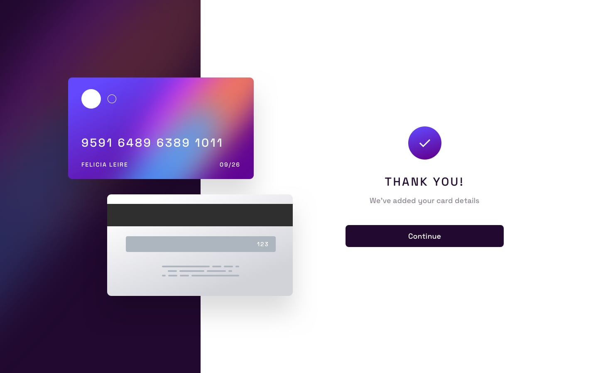

### EN 🌏

<h1 align=center>Frontend Mentor : <strong>"Interactive card details form"</strong></h1>

## Author

- Website - [@Frontend Mentor](https://www.frontendmentor.io/home)
- Frontend Mentor / Profile - [@Sebastian Perez](https://www.frontendmentor.io/profile/SebaPerez90)
- State : "**Finished**"

 

# Desktop Design

 

# Mobile Design

## Welcome! 👋

 

## The challenge 

Your challenge is to build out this interactive card details form and get it looking as close to the design as possible.

You can use any tools you like to help you complete the challenge. So if you've got something you'd like to practice, feel free to give it a go.

Your users should be able to: 

- Fill in the form and see the card details update in real-time
- Receive error messages when the form is submitted if:
  - Any input field is empty
  - The card number, expiry date, or CVC fields are in the wrong format
- View the optimal layout depending on their device's screen size
- See hover, active, and focus states for interactive elements on the page

 

##  Expected behaviour : 

<strong>✔️ Update the details on the card as the user fills in the fields</strong> 
<strong>✔️ Validate the form fields when the form is submitted</strong> 
<strong>✔️ If there are no errors, display the completed state</strong> 
<strong>✔️ Reset the form when the user clicks "Continue" on the completed state</strong> 

**Desktop :**

  

**Mobile :**   
 

## Stack :
<li><b>HTML</b></li>
<li><b>CSS</b></li>
<li><b>Sass</b></li>
<li><b>JAVASCRIPT</b></li>

 

## DEVELOPED BY :

Sebastian Perez - Frontend Developer

